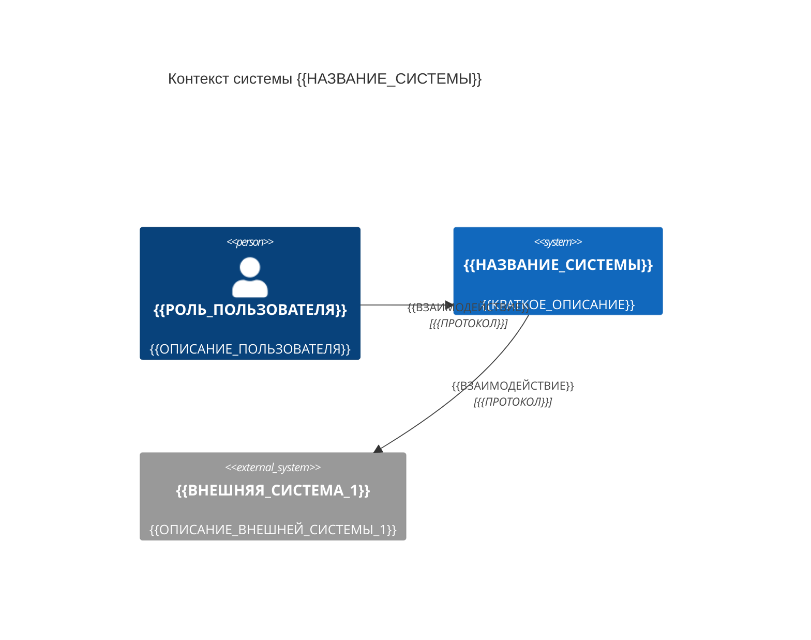
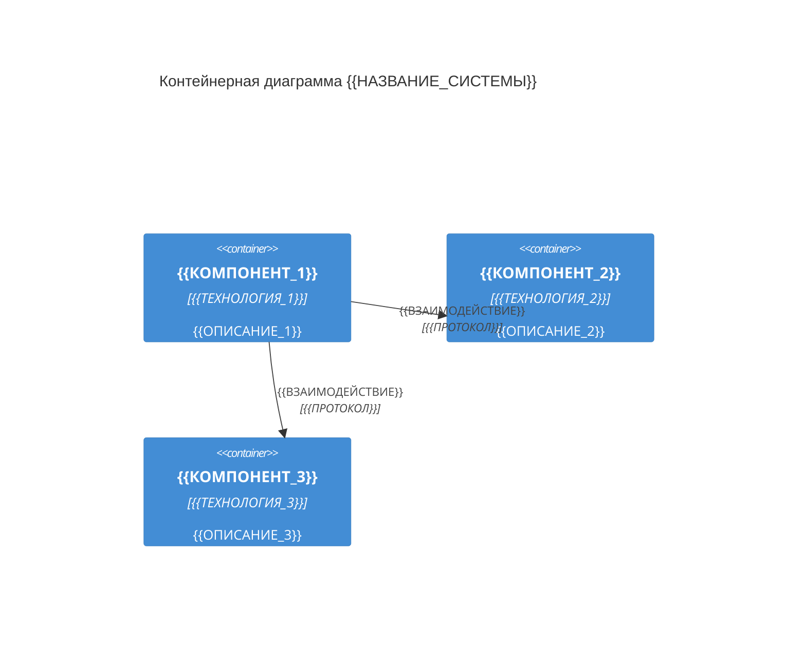

# {{НАЗВАНИЕ_СИСТЕМЫ}}

Техническая спецификация системы {{НАЗВАНИЕ_СИСТЕМЫ}}. Описывает архитектуру, доменные модели, API, инфраструктуру и ограничения.

---

## Навигация

- [Общая информация](#общая-информация)
- [Цели и контекст](#цели-и-контекст)
- [Архитектура](#архитектура)
- [Доменные модели](#доменные-модели)
- [Структура кода (AST)](#структура-кода-ast)
- [API](#api)
- [Инфраструктура](#инфраструктура)
- [Безопасность](#безопасность)
- [Ограничения и допущения](#ограничения-и-допущения)
- [Версионирование](#версионирование)

---

## Общая информация

| Параметр | Значение |
|----------|----------|
| Проект | {{НАЗВАНИЕ_ПРОЕКТА}} |
| Система | {{НАЗВАНИЕ_СИСТЕМЫ}} |
| Версия спецификации | {{ВЕРСИЯ}} |
| Автор | {{АВТОР}} |
| Дата | {{ДАТА}} |
| Задача | {{НОМЕР_ЗАДАЧИ}} |
| Стек | {{ЯЗЫК}} {{ВЕРСИЯ_ЯЗЫКА}}, {{ФРЕЙМВОРК}} {{ВЕРСИЯ_ФРЕЙМВОРКА}} |

---

## Цели и контекст

### Назначение системы

{{ОПИСАНИЕ_НАЗНАЧЕНИЯ_СИСТЕМЫ_1–3_ПРЕДЛОЖЕНИЯ}}

### Бизнес-цели

- {{БИЗНЕС_ЦЕЛЬ_1}}
- {{БИЗНЕС_ЦЕЛЬ_2}}
- {{БИЗНЕС_ЦЕЛЬ_3}}

### Заинтересованные стороны

| Роль | Представитель | Интерес |
|------|--------------|---------|
| {{РОЛЬ_1}} | {{ИМЯ_1}} | {{ИНТЕРЕС_1}} |
| {{РОЛЬ_2}} | {{ИМЯ_2}} | {{ИНТЕРЕС_2}} |

### Контекст системы



---

## Архитектура

### Стиль архитектуры

{{ОПИСАНИЕ_СТИЛЯ_АРХИТЕКТУРЫ}}

> **Примечание:** Подробная архитектурная документация — в [./architecture.md](./architecture.md).

### Компоненты



### Ключевые архитектурные решения

- **{{РЕШЕНИЕ_1}}:** {{ОБОСНОВАНИЕ_1}}
- **{{РЕШЕНИЕ_2}}:** {{ОБОСНОВАНИЕ_2}}

---

## Доменные модели

### Агрегаты

Перечень Aggregate Root с кратким назначением.

| Агрегат | Назначение |
|---------|-----------|
| `{{aggregate_1}}` | {{ОПИСАНИЕ_1}} |
| `{{aggregate_2}}` | {{ОПИСАНИЕ_2}} |

### DSL-модели

```text
model {{entity_name}}
  field id uuid pk
  field {{field_name_1}} {{type_1}}
  field {{field_name_2}} {{type_2}} nullable
  field {{field_name_3}} uuid fk {{related_model}}.id
  field created_at timestamp default now()
  field updated_at timestamp default now()
end
```

```text
model {{entity_name_2}}
  field id uuid pk
  field {{field_name_1}} {{type_1}} unique
  field {{field_name_2}} {{type_2}}
  field {{foreign_key}} uuid fk {{entity_name}}.id
  field created_at timestamp default now()
end
```

> **Примечание:** Разрешённые типы: `uuid`, `string`, `int`, `float`, `bool`, `timestamp`, `date`, `json`.

### Бизнес-правила

- {{ПРАВИЛО_1}}
- {{ПРАВИЛО_2}}
- {{ПРАВИЛО_3}}

---

## Структура кода (AST)

Дерево модулей и классов верхнего уровня. Отражает фактическую структуру исходного кода, не архитектурные слои.

> **Примечание:** Глубина дерева — не более 3 уровней. При росте проекта выносить поддеревья в отдельные файлы.

### Дерево модулей

```text
{{НАЗВАНИЕ_СИСТЕМЫ}}/
├── {{MODULE_1}}/                        # {{ОПИСАНИЕ_МОДУЛЯ_1}}
│   ├── {{SubModule_1_1}}.{{ext}}        # {{ОПИСАНИЕ}}
│   ├── {{SubModule_1_2}}.{{ext}}        # {{ОПИСАНИЕ}}
│   └── {{SubModule_1_3}}/
│       ├── {{Class_1_3_1}}.{{ext}}      # {{ОПИСАНИЕ}}
│       └── {{Class_1_3_2}}.{{ext}}      # {{ОПИСАНИЕ}}
├── {{MODULE_2}}/                        # {{ОПИСАНИЕ_МОДУЛЯ_2}}
│   ├── {{SubModule_2_1}}.{{ext}}        # {{ОПИСАНИЕ}}
│   └── {{SubModule_2_2}}.{{ext}}        # {{ОПИСАНИЕ}}
├── {{MODULE_3}}/                        # {{ОПИСАНИЕ_МОДУЛЯ_3}}
│   ├── {{SubModule_3_1}}.{{ext}}        # {{ОПИСАНИЕ}}
│   └── {{SubModule_3_2}}.{{ext}}        # {{ОПИСАНИЕ}}
└── {{entry_point}}.{{ext}}              # {{ОПИСАНИЕ_ТОЧКИ_ВХОДА}}
```

### Ключевые классы и интерфейсы

```mermaid
classDiagram
  class {{ClassName_1}} {
    +{{field_1}} {{Type}}
    +{{field_2}} {{Type}}
    +{{method_1}}({{param}}) {{ReturnType}}
    +{{method_2}}() {{ReturnType}}
  }

  class {{ClassName_2}} {
    +{{field_1}} {{Type}}
    +{{method_1}}({{param}}) {{ReturnType}}
  }

  class {{InterfaceName_1}} {
    <<interface>>
    +{{method_1}}({{param}}) {{ReturnType}}
    +{{method_2}}() {{ReturnType}}
  }

  {{ClassName_1}} ..|> {{InterfaceName_1}} : implements
  {{ClassName_1}} --> {{ClassName_2}} : uses
```

### Соглашения об именовании

| Конструкция | Стиль | Пример |
|-------------|-------|--------|
| Классы | `{{СТИЛЬ}}` | `{{ПримерКласса}}` |
| Интерфейсы | `{{СТИЛЬ}}` | `{{ПримерИнтерфейса}}` |
| Методы | `{{СТИЛЬ}}` | `{{примерМетода}}` |
| Переменные | `{{СТИЛЬ}}` | `{{пример_переменной}}` |
| Константы | `{{СТИЛЬ}}` | `{{ПРИМЕР_КОНСТАНТЫ}}` |
| Файлы/модули | `{{СТИЛЬ}}` | `{{пример-файла}}.{{ext}}` |

---

## API

### Общие соглашения

| Параметр | Значение |
|----------|----------|
| Стиль | {{REST / GraphQL / gRPC}} |
| Версионирование | {{СТРАТЕГИЯ_ВЕРСИОНИРОВАНИЯ}} |
| Аутентификация | {{МЕХАНИЗМ_АУТЕНТИФИКАЦИИ}} |
| Формат данных | {{JSON / Protobuf / и т.д.}} |
| Базовый URL | `{{BASE_URL}}` |

### Эндпоинты

#### {{ГРУППА_ЭНДПОИНТОВ_1}}

| Метод | Путь | Описание | Авторизация |
|-------|------|----------|-------------|
| `GET` | `/{{resource}}` | {{ОПИСАНИЕ}} | {{РОЛИ}} |
| `POST` | `/{{resource}}` | {{ОПИСАНИЕ}} | {{РОЛИ}} |
| `GET` | `/{{resource}}/{id}` | {{ОПИСАНИЕ}} | {{РОЛИ}} |
| `PUT` | `/{{resource}}/{id}` | {{ОПИСАНИЕ}} | {{РОЛИ}} |
| `DELETE` | `/{{resource}}/{id}` | {{ОПИСАНИЕ}} | {{РОЛИ}} |

#### Пример запроса

```http
POST /{{resource}}
Content-Type: application/json
Authorization: Bearer {{TOKEN}}

{
  "{{field_1}}": "{{value_1}}",
  "{{field_2}}": {{value_2}}
}
```

#### Пример ответа

```json
{
  "id": "{{uuid}}",
  "{{field_1}}": "{{value_1}}",
  "{{field_2}}": {{value_2}},
  "created_at": "{{ISO8601}}"
}
```

### Коды ошибок

| Код | Описание |
|-----|----------|
| `400` | Некорректный запрос |
| `401` | Не аутентифицирован |
| `403` | Нет прав доступа |
| `404` | Ресурс не найден |
| `422` | Ошибка валидации |
| `500` | Внутренняя ошибка сервера |

---

## Инфраструктура

### Окружения

| Окружение | Назначение | URL |
|-----------|-----------|-----|
| `local` | Разработка | `{{LOCAL_URL}}` |
| `staging` | Тестирование | `{{STAGING_URL}}` |
| `production` | Продакшн | `{{PRODUCTION_URL}}` |

### Зависимости

| Компонент | Версия | Назначение |
|-----------|--------|-----------|
| {{ЗАВИСИМОСТЬ_1}} | {{ВЕРСИЯ_1}} | {{НАЗНАЧЕНИЕ_1}} |
| {{ЗАВИСИМОСТЬ_2}} | {{ВЕРСИЯ_2}} | {{НАЗНАЧЕНИЕ_2}} |
| {{ЗАВИСИМОСТЬ_3}} | {{ВЕРСИЯ_3}} | {{НАЗНАЧЕНИЕ_3}} |

### Развёртывание

```mermaid
flowchart LR
  dev[Разработчик] -->|git push| repo[{{РЕПОЗИТОРИЙ}}]
  repo -->|trigger| ci[{{CI_СИСТЕМА}}]
  ci -->|build & test| artifact[Артефакт]
  artifact -->|deploy| staging[Staging]
  staging -->|approve| prod[Production]
```

### Требования к окружению

- CPU: {{МИНИМУМ_CPU}}
- RAM: {{МИНИМУМ_RAM}}
- Диск: {{МИНИМУМ_ДИСК}}
- ОС: {{ЦЕЛЕВАЯ_ОС}}

---

## Безопасность

### Аутентификация и авторизация

- **Механизм:** {{ОПИСАНИЕ_МЕХАНИЗМА}}
- **Хранение токенов:** {{ОПИСАНИЕ}}
- **Время жизни сессии:** {{ПРОДОЛЖИТЕЛЬНОСТЬ}}

### Модель ролей

| Роль | Описание | Права |
|------|----------|-------|
| `{{РОЛЬ_1}}` | {{ОПИСАНИЕ_РОЛИ_1}} | {{ПРАВА_1}} |
| `{{РОЛЬ_2}}` | {{ОПИСАНИЕ_РОЛИ_2}} | {{ПРАВА_2}} |

### Защита данных

- {{МЕРА_ЗАЩИТЫ_1}}
- {{МЕРА_ЗАЩИТЫ_2}}

> **Внимание:** Персональные данные обрабатываются в соответствии с {{РЕГУЛЯТОРНЫЙ_СТАНДАРТ}}.

---

## Ограничения и допущения

### Ограничения

- {{ОГРАНИЧЕНИЕ_1}}
- {{ОГРАНИЧЕНИЕ_2}}
- {{ОГРАНИЧЕНИЕ_3}}

### Допущения

- {{ДОПУЩЕНИЕ_1}}
- {{ДОПУЩЕНИЕ_2}}

### Риски

| Риск | Вероятность | Влияние | Митигация |
|------|-------------|---------|-----------|
| {{РИСК_1}} | {{ВЕРОЯТНОСТЬ}} | {{ВЛИЯНИЕ}} | {{МИТИГАЦИЯ}} |
| {{РИСК_2}} | {{ВЕРОЯТНОСТЬ}} | {{ВЛИЯНИЕ}} | {{МИТИГАЦИЯ}} |

### Не поддерживается

- {{НЕ_ПОДДЕРЖИВАЕТСЯ_1}}
- {{НЕ_ПОДДЕРЖИВАЕТСЯ_2}}

---

## Версионирование

| Версия | Дата | Задача | Описание изменений |
|--------|------|--------|--------------------|
| {{ВЕРСИЯ_1}} | {{ДАТА_1}} | {{НОМЕР_ЗАДАЧИ_1}} | {{ОПИСАНИЕ_ИЗМЕНЕНИЙ_1}} |
| {{ВЕРСИЯ_2}} | {{ДАТА_2}} | {{НОМЕР_ЗАДАЧИ_2}} | {{ОПИСАНИЕ_ИЗМЕНЕНИЙ_2}} |
